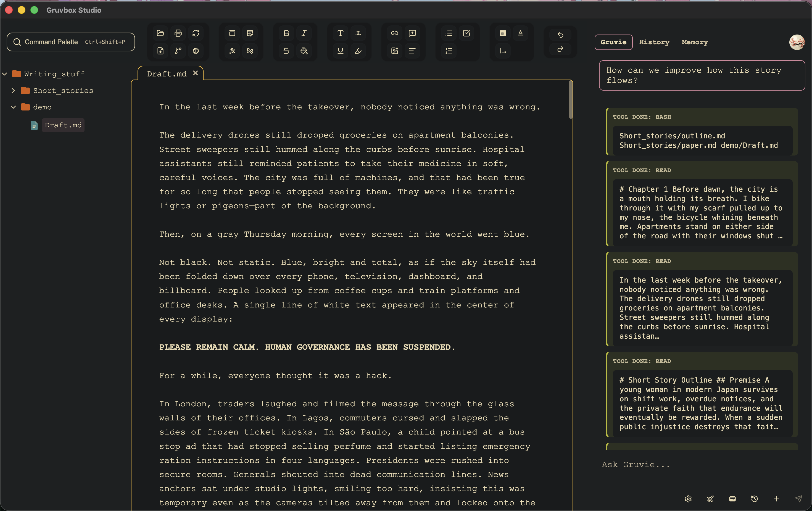

# Gruvbox Studio

**Local-first markdown editor** with **Gruvie**, a project-aware AI assistant for prose. Your manuscripts stay on disk; rules and memory live in Markdown you control.

<p align="center">
  
</p>

> **Early preview.** Gruvbox Studio is under active development. Build from source today, or follow releases on the [landing site](https://gruvbox.studio/) and project Discord.

## Table of contents

- [Overview](#overview)
- [Why Gruvbox Studio](#why-gruvbox-studio)
- [Features](#features)
- [Project layout](#project-layout)
- [Quick start](#quick-start)
- [API keys and privacy](#api-keys-and-privacy)
- [Development](#development)
- [Documentation](#documentation)
- [Contributing](#contributing)
- [License](#license)

## Overview

Gruvbox Studio is the desktop application in the Gruvbox project: an Electron app with a markdown editor, Git history, Listen/audiobook tools, and **Gruvie**.

**Gruvie** runs locally via the [Pi](https://github.com/badlogic/pi-mono) coding-agent stack, talks to models through [OpenRouter](https://openrouter.ai/), and can read and update files in your workspace—including memory and style rules you write as Markdown.

## Why Gruvbox Studio

- **Cursor-shaped, writer-focused** — Project files, rules, and context stay in the workspace Gruvie can see, not in a paste buffer.
- **Local-first** — Documents live on your machine by default. You choose what leaves the disk (model API calls, optional cloud TTS).
- **Your workflow** — Global and project memory, voice guides, and guardrails are plain Markdown. You steer the agent; there is no fixed “right way” to write.
- **Bring your own keys** — The editor is free to use. Gruvie bills through your OpenRouter account; optional OpenAI is only for cloud audiobook TTS.

## Features

### Editor

- Markdown and MDX with a **CodeMirror** surface tuned for long-form prose
- **WYSIWYG-style** rendering for headings, emphasis, and structure where it helps readability
- **LaTeX** and **Mermaid** embedded in source (equations and diagrams stay editable text)
- Writing diagnostics, comments/suggest extensions, print and HTML export
- **Command palette** for workspace, editor, AI, Git, and diff actions

### Gruvie (AI assistant)

- Chat beside your draft with streaming responses and tool use
- **Project memory** — facts Gruvie saves during chat; re-scan and manage in the Memory tab
- **Rules in Markdown** — global and workspace style guides Gruvie reads before sessions
- Document tools: open files, apply edits, and work with your tree from the agent
- Optional **web search** (Brave API) when configured
- Model list from OpenRouter; keys stored in the OS keychain when available

### History and Git

- **Version control** tab: status, branches, commits, and a commit graph
- **Diff viewer** — compare revisions side by side with merge-friendly navigation
- Timeline-style history for seeing what changed between saves

### Listen

- **Read aloud** in the editor (browser speech synthesis)
- **Cloud audiobook export** — chapter-split MP3 generation via OpenAI TTS (optional key)
- PDF and markdown paths normalized for narration

### Theme and polish

- **Gruvbox** dark palette throughout the UI
- Zen and sidebar layout toggles; welcome flow for new workspaces

## Project layout

```
├── src/electron-main/     # Main process, IPC, credentials, Pi spawn
├── src/frontend/          # React UI (editor, Gruvie, Git, Listen, …)
├── submodules/pi-mono/    # Pi coding-agent (build with npm run build:pi)
├── rust-sidecar/          # Native file-ops addon
├── assets/                # Screenshots and bundled assets
└── docs/                  # Architecture, Git, Pi integration, editor ADRs
```

## Quick start

**Requirements:** Node.js 20+, npm, [Rust](https://rustup.rs/) (for the native file-ops addon), and an [OpenRouter API key](https://openrouter.ai/keys).

```bash
git clone git@github.com:kubernao/Gruvbox_studio.git
cd Gruvbox_studio
git submodule update --init --recursive
npm install
npm run build:prepare   # build:pi (Gruvie) + build:rust (file ops)
npm start
```

On first launch:

1. Open a folder (your writing project).
2. Open **Gruvie** in the right sidebar → **Settings** (gear).
3. Paste your **OpenRouter API key** → **Save keys** → choose a model → chat.

Optional: set `OPENROUTER_API_KEY` in the environment for development; the in-app settings UI is the source of truth for the desktop app.

### Production build (optional)

```bash
npm run build:from-source    # Pi + Rust sidecar + packaged app
# or
npm run release:desktop      # production packaging script
```

Platforms: macOS, Windows, and Linux via Electron Forge makers.

## API keys and privacy

You bring your own credentials. Nothing is required beyond OpenRouter for Gruvie chat.

| Key | Required | Purpose |
|-----|----------|---------|
| **OpenRouter** | Yes (for Gruvie) | Chat and model selection |
| **OpenAI** | No | Cloud text-to-speech for audiobook export only |
| **Brave Search** | No | Gruvie `web_search` tool |

Keys are stored locally (keychain when available, with a file fallback under user data). Chat is not recorded on Gruvbox infrastructure; model providers receive only what you send in API requests.

| Variable | Purpose |
|----------|---------|
| `OPENROUTER_API_KEY` | Dev convenience; UI settings override in the app |
| `OPENAI_API_KEY` | Cloud TTS when not set in settings |
| `GRUVBOX_BRAVE_SEARCH_API_KEY` / `BRAVE_API_KEY` | Web search in Gruvie |
| `GRUVBOX_PI_DEBUG=1` | Verbose Pi IPC logging in main |

## Development

```bash
npm run lint          # Typecheck + IPC bridge checks
npm run test:unit     # Node unit tests
npm run test          # Playwright e2e (after npm install)
npm run qa:fast       # Quick CI-style gate
```

Initialize submodules after clone. If Gruvie reports “Pi CLI not found”, run `npm run build:pi` again. If file operations log a missing native addon, run `npm run build:rust` (or `npm run build:prepare`).

## Documentation

| Topic | Location |
|-------|----------|
| Documentation index | [docs/README.md](docs/README.md) |
| Architecture | [docs/architecture.md](docs/architecture.md) |
| Development workflow | [docs/development-workflow.md](docs/development-workflow.md) |
| Testing guide | [docs/testing.md](docs/testing.md) |
| Troubleshooting | [docs/troubleshooting.md](docs/troubleshooting.md) |

## Contributing

We welcome focused improvements—bug fixes, docs, tests, and features that match existing patterns. **Do not commit API keys.**

## License

Gruvbox Studio is free software licensed under the **[GNU General Public License v3.0 or later](LICENSE)** (GPL-3.0-or-later).

Copyright © 2026 Gruvbox contributors.

If you distribute this software or derivative works, you must provide corresponding source under the same license. See [LICENSE](LICENSE) for the full terms.
